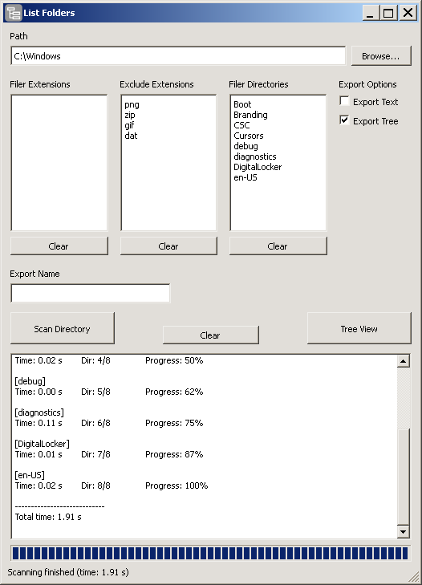
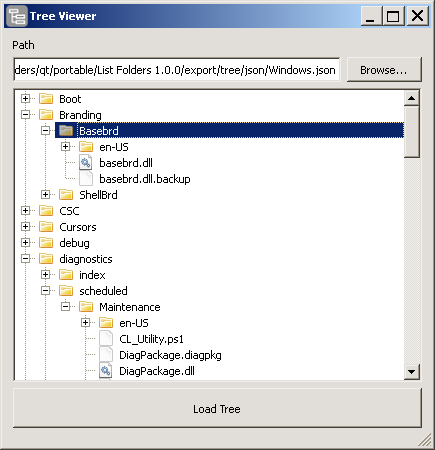

# List Folders

## Description

The program is used to list files and subfolders inside a selected local file system path. 
It is possible to customize filters to exclude/include files and include directories. 
Three export options are available:
 - **Export Text** - get text file with the folder structure
 - **Export Markup** - get HTML markup
 - **Export Tree** - get JSON and HTML files for [jsTree](http://jstree.com/) jQuery plugin to view folder structure in tree mode
 
Additional **Export name** field allows set different name for exported files. By default the root folder name is used.
Manage Options block allows save current options (path and filters) to the database and then retrieve them using the dropdown. After selecting a list item it's possible to remove it with the near Remove button.

## Usage

1. Paste a directory path in the first field.
2. Add extensions to **Filter Extensions** to include only files with specified extensions.
3. Add extensions to **Exclude Extensions** to exclude files with these extensions (the **Filter Extensions** text will be ignored).
4. Add folder names (that are subfolders or current directory from the path) to **Filter Directories** to include only these directories.
5. Select **Export Options**
  - **Export Text** - creates `.txt` file with the directory structure in the `export/text` folder.
  - **Export Markup** - creates `.html` file with the same text as for the **Export Text** but with wrapped directory/file names in appropriate  elements. The file is created in the `export/markup` folder.
  - **Export Tree** - creates two files: `.html` in the `export/tree` subfolder of the project main folder and `.json` in the `export/tree/json` subfolder.
  The `.html` file can be run directly to view the scanned directory content in the tree format. It uses jsTree plugin for jQuery to give representation and interaction of a file tree on the HTML page.
6. If **Export Tree** is selected additional field **Export Name** appears. You may set your name which will be given to `.html` and `.json` files in the `export/tree` folder when the tree view is exported. Or leave it blank to use the selected directory as the Tree name.
7. Press **Scan Directory**.
8. After scanning you should see the text output of the directory structure on the current page. Check the `export` folder for created files.
9. To check tree view go to `export/tree` and open `.html` file in browser. It should show the directory structure with expandable tree branches.

## Manage Options

1. To **save** current path and filters enter name in the field and press **Add**.
2. To **load** a saved option select a name from the list.
3. To **remove** a saved option select a name and press **Remove**.

## Screenshots

